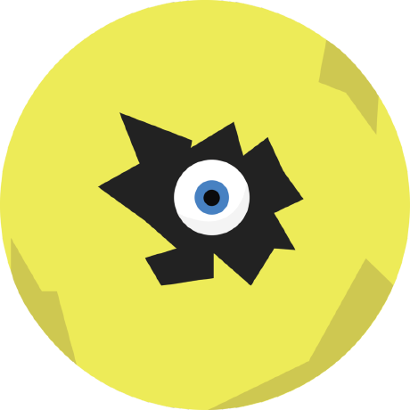

# Rasteron

A raster image loader, manipulation, and generation project. Supports PNG, TIFF, and BMP file formats. Supported on Linux and Windows

zlib, libpng, and libtiff are built by the project and freetype is built optionally to enable font rasterisation.

Project Structure:

1. **core** contains core items necessary for working with generic images (Image), generating noise images (Noise), cell algorithm images (Cellwise), with support for types including coordinate, geometric, and palette types
2. **plugin** contains plugin functionality for optional queue support and font format loading
3. **util** contains util files for Windows and Unix specific functionality
4  **assets** contains fonts, images, and other resources